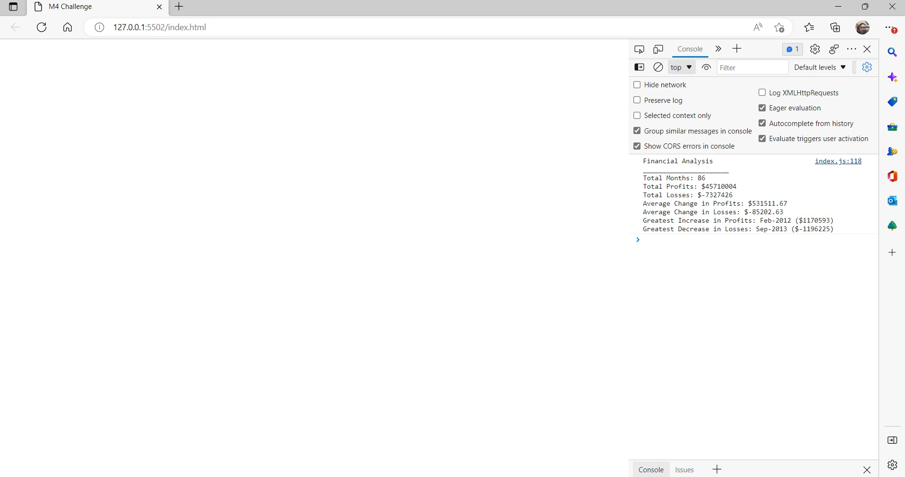

# Console_Finances

#
The code in this repository analyses the financial records of a company. A live demo can be found [here](https://emman77240.github.io/Console_Finances/).

## Description
In this repository, the analysis of a company's financial records is programmatically computed using JavaScript. A live demonstration can be seen by taking a look at the browser console. 

This website is hosted on GitHub Pages, enabling it to be seen world wide when the website address is visited.

## Installation
N/A

## Usage
On your browser, the Console can be found under Developer Tools. Open the Console to view the JavaScript analysis.

## License
MIT License